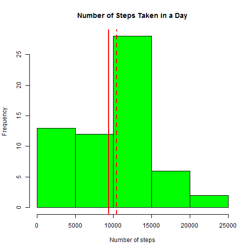
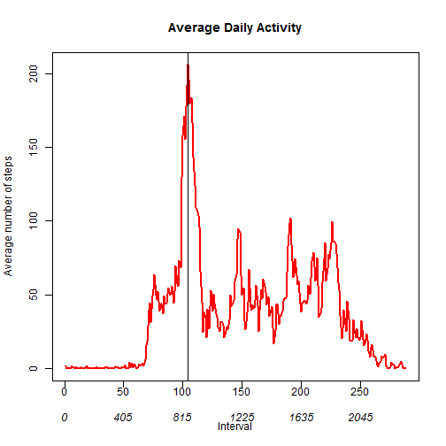
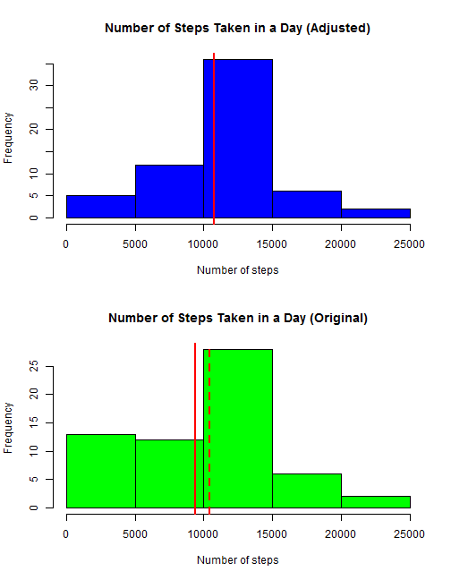
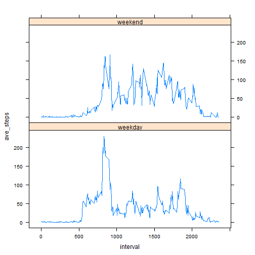

  
  
The first important part of most assignments is reading in the data. I have saved the data with a file name *RepData_PeerAssessment1* in the following directory *C:/Users/J Miller/Desktop/Data Science Course/Reproducible Research*. If you are using this document in the interest of reproducing my output, it is vital that the first line of the below code be edited to reference the file location in your system. Further, we will be using the latice package in this assignment, so it might be good to load it here.
  


```r
setwd("C:/Users/J Miller/Desktop/Data Science Course/Reproducible Research/RepData_PeerAssessment1")
require(lattice)
```

```
## Loading required package: lattice
```

With that set, we are able to use the following code to load the data. Notice also that the data contains a variable called *date* which we will convert to a date class variable.

```r
a <- read.csv("./activity/activity.csv")
a$date = as.Date(a$date)
```

  
And so we are ready to answer the first question, **What is the mean total number of steps taken per day?** Often we are interested in more than simply a single mean figure, so we will also plot a histogram of the steps taken each day as well as looking at a 5 number summary + the mean. For this part of the assignment, we can ignore the missing values in the dataset.


```r
days = as.data.frame(unique(a$date))
days[,2] = tapply(a$steps,a$date,sum,na.rm=T)
colnames(days)[2]="steps"
m = mean(days$steps,na.rm=T)
print(m)
```

```
## [1] 9354.23
```

```r
par(mar=c(5, 4, 4, 2) + 0.1)
hist(days$steps,col="green",mfrow=c(1,1),xlab = "Number of steps",main = "Number of Steps Taken in a Day")
abline(v=m, lwd=2, col="red")
s = summary(days$steps)
abline(v=s[3], lwd=2, col="red", lty = 2)
```



```r
print(s)
```

```
##    Min. 1st Qu.  Median    Mean 3rd Qu.    Max. 
##       0    6778   10400    9354   12810   21190
```

From the above, we can see that on average 9354 steps are taken each day compared to the median of 10400 steps.  
  
Noting this, let us consider the next question **What is the average daily activity pattern?** To do this, we consider the average number of steps for each interval across the 61 days. That is, looking at the same interval on each day, what is the average of those 61 intervals?
  

```r
mti = tapply(a$steps,a$interval,mean,na.rm=T)
plot(mti,type="l",lwd=2,col="red",xlab="Interval",xaxt="n",ylab="Average number of steps",main="Average Daily Activity")
lablist = names(mti)
select = seq(0,288,by=50); lablist = lablist[select]; lablist[2:6] = lablist[1:5]; lablist[1]= "0"
axis(1, at=seq(0, 288, by=50), labels = FALSE, tck=-.02)
text(seq(0, 288, by=50),par("usr")[3], labels = c("0","50","100","150","200","250"), pos = 1, xpd = TRUE)
text(seq(0, 288, by=50),par("usr")[3]-17, labels = lablist, pos = 1, xpd = TRUE, font=3,cex.lab=0.1)
abline(v=which(mti==max(mti,na.rm=T)))
```


  
And from the above it is easy to see that there are times in the day which are more active. The most active interval being interval 104 or 835 with 206 steps.
  
However, all the analysis thus far has been conducted ignoring missing values. What if we were instead interested in replacing missing values with estimates? Let us first inspect the data for missing values or NA's as they may appear here.


```r
sum(!complete.cases(a))
```

```
## [1] 2304
```

But using is.na(), we discover that only 'steps' has missing values


```r
sum(is.na(a$steps))
```

```
## [1] 2304
```

```r
sum(is.na(a$date))
```

```
## [1] 0
```

```r
sum(is.na(a$interval))
```

```
## [1] 0
```
  
Now let us replace NA's with the mean for that 5 minute interval

```r
a2 = a
for(i in 1:length(a2$steps))
{
    if(is.na(a2[i,1]))
    {
        a2[i,1] <- mti[paste(a2[i,3])]
    }
}
```
  
And so we have created a new dataset equal to the original dataset, but with the missing data filled in. Now let's look at how this data set compares to the original.


```r
days2 = as.data.frame(unique(a2$date))
days2[,2] = tapply(a2$steps,a2$date,sum,na.rm=T)
colnames(days2)[2]="steps"


par(mar=c(5, 4, 4, 2) + 0.1,mfrow=c(2,1))
hist(days2$steps,col="blue",xlab = "Number of steps",main = "Number of Steps Taken in a Day (Adjusted)")
s2 = summary(days2$steps)
abline(v=s2[4], lwd=2, col="red")
abline(v=s2[3], lwd=2, col="red", lty = 2)
hist(days$steps,col="green",xlab = "Number of steps",main = "Number of Steps Taken in a Day (Original)")
abline(v=m, lwd=2, col="red")
abline(v=s[3], lwd=2, col="red", lty = 2)
```



```r
print(s2)
```

```
##    Min. 1st Qu.  Median    Mean 3rd Qu.    Max. 
##      41    9819   10770   10770   12810   21190
```

```r
print(s)
```

```
##    Min. 1st Qu.  Median    Mean 3rd Qu.    Max. 
##       0    6778   10400    9354   12810   21190
```
  
From the above we can see that the adjustment has affected the lower half of the distribution, shifting the median only slightly upward, but moving the mean considerably to be equal to the new median in the new distribution. This suggests that such and adjustment must be made with care as it does give us control of the distribution which may lead to wrong conclusions.
  
Finally, let us consider the question of **Differences in activity patterns between weekdays and weekends.** As a logical consideration, it would make sense that there is a difference between activity throughout the day when comparing weekdays to weekends, but what does this difference look like?
  

```r
a2[,4] = weekdays(a2[,2])
colnames(a2) <- c("steps","date","interval","day_type")
for(i in 1:length(a2$day_type))
{
    if(a2[i,4] %in% c("Saturday","Sunday"))
    {
        a2[i,4] <- "weekend"
    }
    else a2[i,4] <- "weekday"
}
a2[,4] = as.factor(a2[,4])

mtiwkend = as.data.frame(tapply(subset(a2,day_type=="weekend")$steps,subset(a2,day_type=="weekend")$interval,mean,na.rm=T))
mtiwkend[,2]=c("weekend")
mtiwkend[,3]=rownames(mtiwkend)
colnames(mtiwkend) = c("ave_steps","day_type","interval")
mtiwkday = as.data.frame(tapply(subset(a2,day_type=="weekday")$steps,subset(a2,day_type=="weekday")$interval,mean,na.rm=T))
mtiwkday[,2]=c("weekday")
mtiwkday[,3]=rownames(mtiwkday)
colnames(mtiwkday) = c("ave_steps","day_type","interval")

mtitot = rbind(mtiwkend,mtiwkday)
mtitot$day_type = as.factor(mtitot$day_type)
mtitot$interval = as.numeric(mtitot$interval)

xyplot(ave_steps~interval|day_type,data=mtitot,layout=c(1,2),type="l")
```


  
Keeping in mind that interval represents a real time during the day, we see that before 05:00 or interval 500, neither the weekend nore weekdays exibit much activity, but that the bulk of activity occurs between 05:00 (500) and just after 20:00 (2000). The most notable difference between the weekends and weekdays then, is a more evenly spread level of activity throughout this period. While the overall peek at 08:35 (835) seems to be, at least roughly, the most active time of day across both weekdays and weekends, it is far more extreme during the week. The above may also suggest that the weekend is overall more active, but further analysis of the mean, median and other measures would have to be considered before such a conclusion could be drawn.

